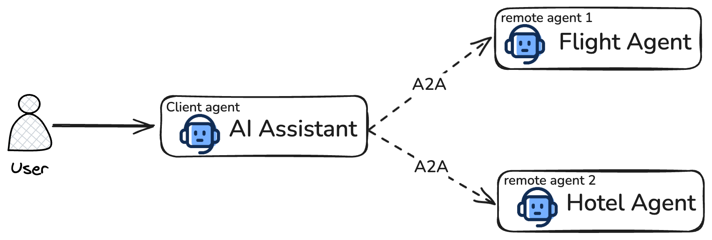

# A2A Protocol Demo



This tutorial contains demo of A2A protocol using Google ADK.

There are 3 agents involved:

1. **AI Assistant:** This is a local agent where user will communicate directly.
2. **Flight Agent:** This is first remote agent which helps in searching flights from Serp API.
3. **Hotels Agent:** This is second remote agent which helps in searching hotels from Serp API.

---

## Prerequisites

- Python installed
- A **GCP Project** with:
  - **Billing enabled**
  - **Vertex AI APIs** enabled
- SerpAPI account and its API key

---

## Setup environment

### 1. Clone the Repository
```bash
git clone <repo_url>
cd <repo_name>/a2a_1_adk_client_and_remote/
```

### 2. Setup Python Environment

```bash
python3 -m venv .venv
source .venv/bin/activate
```

### 3. Install python packages

```bash
python -m pip install -r requirements.txt
```


## Run first remote agent (Flight Agent)

### 1. Setup env file

Copy env file and update the provided variables in each

```bash
cp remote_agent_1/.env.example remote_agent_1/.env
```

### 2. Run Remote Agent 1

Expose the agent using uvicorn on port 8001.
```bash
source remote_agent_1/.env
uvicorn remote_agent_1.flight_agent:a2a_app --host localhost --port 8001
```

### 3. Verify Agent Card

Open URL "http://localhost:8001/.well-known/agent-card.json" in the browser.


## Run second remote agent (Hotels Agent)

Lets first remote agent run in the first terminal. Now, Open another terminal.

### 1. Setup env file

Copy env file and update the provided variables in each

```bash
cp remote_agent_2/.env.example remote_agent_2/.env
```

### 2. Run Remote Agent 2

Expose the agent using adk api server.

```bash
cd remote_agent_2
source .env
adk api_server --a2a --port 8002
```

### 3. Verify Agent Card

Open URL "http://localhost:8002/a2a/hotels_agent/.well-known/agent-card.json" in the browser.


## Run Local Agent

Lets second remote agent run in the above terminal. Now, Open another terminal.

### 1. Setup env file

Copy env file and update the provided variables in each

```bash
cd adk_3_a2a_protocol/local_agent/
cp .env.example remote_agent_2/.env
```

### 2. Run Client Agent

Run it using adk web.
```bash
adk web
```

### 3. Access the agent

Open URL "http://localhost:8000" in the browser.

