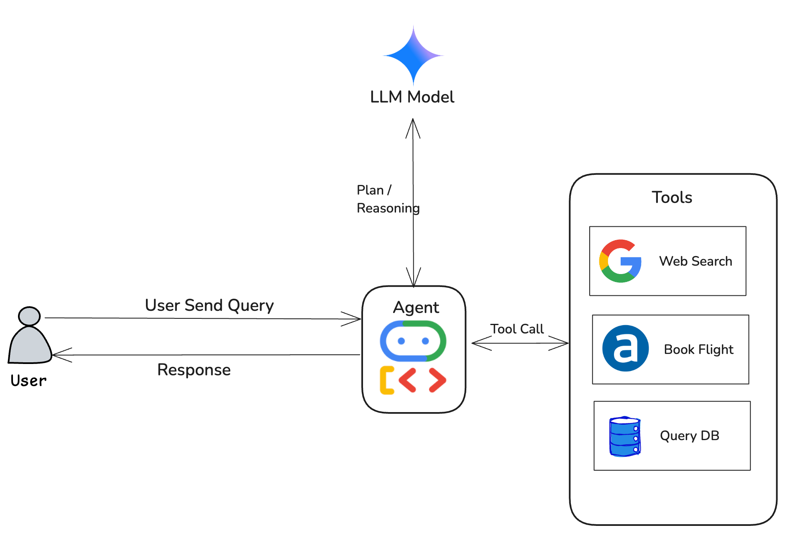

# Google ADK Agent with Google Search Tool 



This repository demonstrates how to build, run, and deploy an AI agent using **Google Agent Development Kit (ADK)** with a **Google Search tool integration**. The tutorial covers running the agent locally and deploying it to **Agent Engine** on GCP.

---

## Prerequisites

- Python 3.9+ installed
- [gcloud CLI](https://cloud.google.com/sdk/docs/install) configured
- A **GCP Project** with:
  - **Billing enabled**
  - **Vertex AI APIs** enabled
- A **GCS bucket** for staging artifacts

---

## Run the Agent Locally

### 1. Clone the Repository
```bash
git clone <your-repo-url>
cd <your-repo>
```

### 2. Setup Python Environment

```bash
python3 -m venv .venv
source .venv/bin/activate
```

### 3. Install Google ADK

```bash
python -m pip install google-adk
```

### 4. Install gcloud and authenticate 

This step is not required if using Google cloud shell for development.  
 - Install gcloud cli by following [here](https://cloud.google.com/sdk/docs/install).
- Run below commands to initialize and authenticate to gcp.

```bash
gcloud init
gcloud auth application-default login
```

### 5. Setup env file

Copy env file and update the provided variables.

```bash
cp .env.example .env
```

### 6. Run Agent Locally

- Via CLI 
```bash
adk run agent_name
```
- Via web UI. Access via the provided local URL.
```bash
adk web
```

## Deploy Agent to Agent Engine

First install vertex AI SDK:
```bash
python -m pip install "google-cloud-aiplatform[adk,agent_engines]" cloudpickle
```

Agent can be deployed in either one way:

### 1. Deploy via Python

Follow the deployment script:
```bash
python deploy.py
```

### 2. Deploy via CLI
```bash
adk deploy agent_engine \
    --project=[project] \
    --region=[region] \
    --staging_bucket=[staging_bucket] \
    --display_name=[app_name] \
    path/to/your/agent_folder
```

## Access Deployed Agent

Once deployed, you can access your agent via the **Agent Engine API** for production use. 

```bash
curl --request POST \ 
 'https://aiplatform.googleapis.com/v1/project/<project_id>/locations/<region>/reasoningEngines/<agent_id>:streamQuery' \
  --header 'Authorization: Bearer $(gcloud auth print-access-token)' \
  --header 'Content-Type: application/json' \
  --data '{
	  "class_method": "stream_query",
	  "input": {
		  "message": "When did Real Madrid played his last match and what was the outcome?",
		  "user_id": "randome_user_id"
	  }
  }' 
```

## Reference URLs

- ADK official documentation: https://google.github.io/adk-docs/get-started/quickstart/
- Sample Agents: https://github.com/google/adk-samples
- REST API to deployed Agent: https://cloud.google.com/vertex-ai/generative-ai/docs/reference/rest/v1/projects.locations.reasoningEngines/streamQuery
